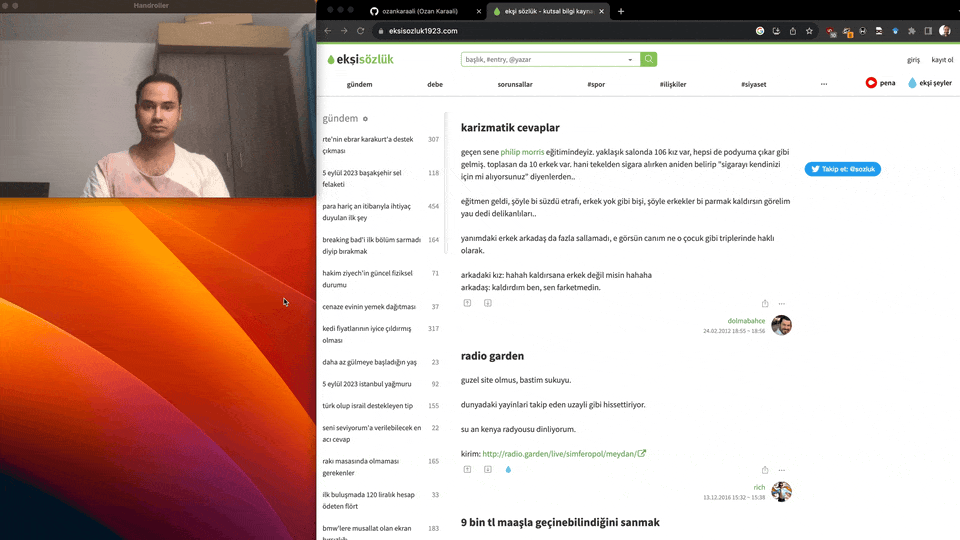

# Handroller


Handroller is a tool that lets you control your mouse using hand gestures, developed out of sheer boredom but with utmost dedication.

## Demo


## Features

- Detects hand gestures using your camera and translates them to mouse movements.
- Optionally display the video feed with hand landmarks and detected gestures using the `--display` argument.
- Works on various platforms including macOS, Windows, and Linux. (At least it should, I only tested it on macOS.)

## Usage

```bash
pip install -r requirements.txt
python main.py [--display]
```

or you can download a release for now releases might be broken.

## Dependencies
- OpenCV
- Mediapipe
- PyAutoGUI

## Acknowledgements

A big thanks to:

- [OpenCV](https://opencv.org/)
- [Mediapipe](https://developers.google.com/mediapipe/)
- [PyAutoGUI](https://pyautogui.readthedocs.io/en/latest/)
- [ChatGPT](https://chat.openai.com/)
- [Ideogram](https://ideogram.ai)
- [Gifski](https://gif.ski)

These projects made Handroller possible. Yes, I thank ChatGPT too, it made me possible to write this in like 1-2 hours, just for the LULZ.

## License

This project is licensed under the MIT License - see the [LICENSE](LICENSE) file for details.
